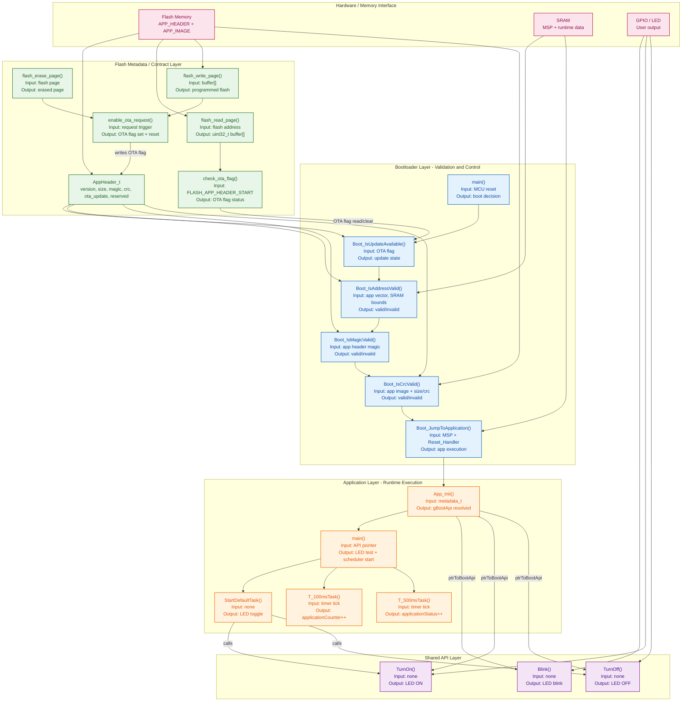

# Firmware Architecture Flow Diagram

This version is structured as a layered system architecture. It separates the boot validation path, flash contract, runtime application, and API interface into clear blocks so the control flow and data flow are easier to read.

## 1. System-Level Architecture

## 2. Functional Input/Output View

### Bootloader functions

- main()
  - Input: reset event, HAL init, system config
  - Output: validation sequence and either jump or lock-up state

- Boot_IsUpdateAvailable()
  - Input: OTA flag stored in app header
  - Output: status flag, OTA cleared if requested, or continue to validation

- Boot_IsAddressValid()
  - Input: application stack pointer and reset handler address
  - Output: true/false, plus bootloader status code

- Boot_IsMagicValid()
  - Input: application header magic value
  - Output: true/false, plus status code if invalid

- Boot_IsCrcValid()
  - Input: application payload, image size, and CRC from header
  - Output: true/false, plus status code on mismatch

- Boot_JumpToApplication()
  - Input: MSP, reset handler pointer, vector table address
  - Output: application reset handler entry

### Flash metadata and OTA helpers

- AppHeader_t
  - Input: version, size, magic, crc, ota_update, reserved
  - Output: validated metadata contract between images

- flash_read_page()
  - Input: page_start_addr, uint32_t buffer[]
  - Output: flash content copied to RAM buffer

- flash_erase_page()
  - Input: page address
  - Output: flash page erased before data update

- flash_write_page()
  - Input: page_start_addr, buffer[]
  - Output: new flash content written back

- check_ota_flag()
  - Input: pointer to header location
  - Output: OTA request status and cleared OTA bit

- enable_ota_request()
  - Input: OTA trigger from software
  - Output: OTA flag set in flash and pending reset

### Application functions

- App_Init()
  - Input: metadata_t pointer at METADATA_ADDRESS
  - Output: boot API pointer resolved to `gBootApi`

- main()
  - Input: boot API pointer and runtime init state
  - Output: LED startup pattern + RTOS task creation

- StartDefaultTask()
  - Input: task start context
  - Output: toggles LED on/off periodically

- T_100msTask()
  - Input: periodic timer event
  - Output: increments `applicationCounter`

- T_500msTask()
  - Input: periodic timer event
  - Output: increments `applicationStatus`

### Shared API functions

- Blink()
  - Input: none
  - Output: LED pattern through bootloader-owned hardware function

- TurnOn()
  - Input: none
  - Output: GPIO LED ON state

- TurnOff()
  - Input: none
  - Output: GPIO LED OFF state

## 3. Control-Flow Narrative

1. System powers on and enters the bootloader `main()`.
2. Bootloader checks the OTA flag in the metadata header.
3. It validates the application stack pointer, reset handler, magic, and CRC.
4. If all checks pass, it jumps to the application reset handler.
5. Application `App_Init()` resolves the shared API pointer from flash metadata.
6. Runtime tasks execute and call LED functions owned by the bootloader.
7. OTA requests are stored in the flash header and applied through the metadata update routines.

## 4. Architecture Interpretation

This is a classic split-image firmware architecture:

- Bootloader owns trust, validation, and reset control.
- Flash metadata owns the contract between images.
- Application owns runtime behavior and scheduling.
- Shared API provides controlled communication to bootloader-owned hardware features.

This structure is well suited for embedded firmware where image safety and controlled transfer of execution are critical.
